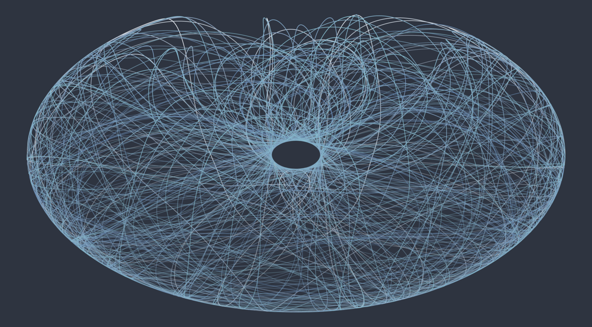

# Double Pendulum



This repository contains the Python code for a double-pendulum simulation.

## Implementation

The second-order differential equations for the two angles are derived below in the [Analytics]{#analytics} section. They are solved using fourth-order Runge-Kutta.

## Usage

The help message can be shown as follows:

```sh
$ python3 double_pendulum.py -h
usage: double_pendulum.py [-h] [--m1 M1] [--m2 M2] [--r1 R1] [--r2 R2] [--v1 V1] [--v2 V2] [--i1 I1] [--i2 I2] [--dt DT] [-g GRAVITY] [--steps STEPS] [--pause PAUSE] [-d] [--dpi DPI]
                          [--marker-size MARKER_SIZE] [--mod MOD] [-p SHOW_PAST] [--output OUTPUT] [--ot1 OT1] [--ot2 OT2] [--delta-t2 DELTA_T2]

Double Pendulum Simulation

This scripts simulates a double pendulum.
Physics-related paramters such as
- the two masses in the pendulum
- the two lengths of the two rods in the pendulum
- the initial angular velocities of the pendulum
- the gravitational constant

as well as paramters to tweak the simulation (see
help message) can be provided on the command-line.

Interesting parameters are `--display` and `--show-past`.
The first one not only generates a picture of the of the
trajectory of the bottom mass but also shows the animated
simulation while the second adds a trail of all past positions
of the bottom mass to the simulation.

An image of the positions visited by the bottom mass can be 
stored using the `--output` flag.

options:
  -h, --help            show this help message and exit
  --m1 M1               The value of the first mass [kg]
  --m2 M2               The value of the second mass [kg]
  --r1 R1               The length of the first pendulum rod [m]
  --r2 R2               The length of the second pendulum rod [m]
  --v1 V1               The first initial angular velocity [rad / s]
  --v2 V2               The second initial angular velocity [rad / s]
  --i1 I1               The initial value for the first angle
  --i2 I2               The initial value for the first angle
  --dt DT               The simulation time stamp in seconds
  -g GRAVITY, --gravity GRAVITY
                        The value for the gravitational constant [N * m^2 / kg^2]
  --steps STEPS, -s STEPS
                        The number of simulation steps
  --pause PAUSE         The pause between different renderings
  -d, --display         Display the simulation
  --dpi DPI             The image resolution in dpi.
  --marker-size MARKER_SIZE
                        The marker-size.
  --mod MOD, -m MOD     When the simulation is shown, only display every `mod` step
  -p SHOW_PAST, --show-past SHOW_PAST
                        Specify how many past positions should be shown in the tail
  --output OUTPUT, -o OUTPUT
                        The output path of the plot
  --ot1 OT1             Output a plot of the theta1 angle over time.
  --ot2 OT2             Output a plot of the theta2 angle over time.
  --delta-t2 DELTA_T2   Optional small offset of theta_2. Show how trajectories are sensible to initial conditions.
```

Thus, a command to display the simulated pendulum with default physical parameters
and show a trail of the past 5000 positions of the bottom pendulum as well is given by:

```sh
python3 double_pendulum.py --display --show-past 5000 -o double_pendulum.png
```

The `-o` flag provides the name of the output file and stores the positions of the bottom 
pendulum path in that image.

If only the simulation shall be shown without producing an output image one can run the following
command where only every hundredth step (`-m 100`) is shown to improve the rendering speed:

```sh
python3 double_pendulum.py -d -p 5000 -s 20000 -m 100
```

To show the sensitive dependence of the system on the initial conditions, one can specify a tiny offset
in the initial conditions for the angle `theta_2` as a command-line parameter. This will include in the
simulation a second double-pendulum with the same initial conditions as that of the first one, except the
angle `theta_2` being offset by specified (small) value. The corresponding command is:

```sh
python3 double_pendulum.py -d -p 5000 -s 20000 -m 100 --delta-t2 0.0001 -s 50000
```

---

## Analytics {#analytics}

We consider the system of a double pendulum. It consists of a first mass $m_1$ attached to a rigid rod
of length $r_1$. Attached to the first mass is a second pendulum with a rigid rod of length $r_2$ and
a mass $m_2$. We consider both rods to be massless and we ignore friction in the following derivation.

The select the coordinate system in such a way that the origin corresponds to the suspension point of the
first pendulum, i.e. the top end of the rod of length $r_1$. Furthermore, we define the angles $\theta_1$
and $\theta_2$ to be the deviations from the vertical drawn through the suspension point of the respective
pendulum. For the first pendulum, the vertical is drawn through the origin. For the second pendulum, the
suspension is the first mass $m_1$, so the angle $\theta_2$ is measured with respect to the vertical passing
through $m_1$. This way, the coordinates of the two masses $m_1\,(x_1, y_1)$ and $m_2\,(x_2, y_2)$ can be
expressed as:

```math
\begin{align}
    x_1 &= r_1\,\sin\theta_1 \\
    y_1 &= -r_1\,\cos\theta_1 \\
    & \\
    x_2 &= r_1\,\sin\theta_1 + r_2\,\sin\theta_2 \\
    y_2 &= -r_1\,\cos\theta_1 - r_2\,\cos\theta_2
\end{align}
```

The velocities can be derived by computing the derivatives with respect to time:

```math
\begin{align}
    \dot{x}_1 &= r_1 \, \omega_1 \, \cos\theta_1 \\
    \dot{y}_1 &= r_1 \, \omega_1 \, \sin\theta_1 \\
    & \\
    \dot{x}_2 &= r_1 \, \omega_1 \, \cos\theta_1 + r_2 \, \omega_2 \, \cos\theta_2 \\
    \dot{y}_2 &= r_1 \, \omega_1 \, \sin\theta_1 + r_2 \, \omega_2 \, \sin\theta_2
\end{align}
```

Here, we have introduced the angular velocities $\omega_1$ and $\omega_2$ defined as:

```math
\begin{align}
    \dot{\theta}_1 &= \omega_1 \\
    \dot{\theta}_2 &= \omega_2
\end{align}
```

The kinetic energy $T$ of the first mass is:

```math
\begin{align}
    T_1 &= \frac{1}{2}\,m_1 \, \left( \dot{x}_1^2 + \dot{y}_1^2 \right) \\
        &= \frac{1}{2}\,m_1 \, r_1^2 \, \omega_1^2 \, (\cos^2\theta_1 + \sin^2\theta_1) \\
        &= \frac{1}{2}\,m_1 \, r_1^2 \, \omega_1^2
\end{align}
```

while that of the second one reads

```math
\begin{align}
    T_2 &= \frac{1}{2} \, m_2 \, \left(\dot{x}_2^2 + \dot{y}_2^2\right) \\
        &= \frac{1}{2} \, m_2 \, \left[ \left( r_1\, \omega_1 \, c_1 + r_2 \, \omega_2 \, c_2 \right)^2 + \left( r_1 \, \omega_1 \, s_1 + r_2 \, \omega_2 \, s_2 \right)^2 \right] \\
        &= \frac{1}{2} \, m_2 \, \left(r_1^2\,\omega_1^2\,c_1^2 + r_2^2\,\omega_2^2\,c_2^2 + 2 \,r_1 \,r_2 \,\omega_1 \,\omega_2 \,c_1\,c_2
                                     + r_1^2\,\omega_1^2\,s_1^2 + r_2^2\,\omega_2^2\,s_2^2 + 2 \,r_1 r\,_2 \,\omega_1 \,\omega_2 \,s_1\,s_2 \right) \\
        &= \frac{1}{2} \, m_2 \, \left(r_1^2\,\omega_1^2 + r_2^2\,\omega_2^2 + 2\, r_1 \, r_2 \, \omega_1 \, \omega_2 \, \cos(\theta_1 - \theta_2) \right)
\end{align}
```

Here we have used the abbreviations $c_i = \cos\theta_i$ and $s_i = \sin\theta_i$ to shorten the expressions and made use of the identity

```math
    \cos(\alpha - \beta) = \cos \alpha \, \cos \beta + \sin \alpha \, \sin \beta
```

In both cases, the contribution to the potential energy $V$ is only given by the gravitational potential and reads

```math
\begin{align}
    V_1 &= m_1 \, g \, y_1 = - m_1 \, g \, r_1 \, \cos\theta_1 \\
    V_2 &= m_2 \, g \, y_2 = - m_2 \, g \, r_1 \, \cos\theta_1 - m_2 \, g \, r_2 \, \cos\theta_2
\end{align}
```

To make the equations below easier to read, we introduce the following notation:

```math
\begin{align}
    m_{12} &= m_1 + m_2 \\
    \theta_{12} &= \theta_1 - \theta_2
\end{align}
```

To derive the differential equations governing the dynamics of the two angles we will use the *Euler-Lagrange* equations:

```math
  \frac{\mathrm{d}}{\mathrm{d}t}\frac{\partial L}{\partial \omega_i} - \frac{\partial L}{\partial \theta_i} = 0
```

with

```math
\begin{align}
    L &= T - V \\
      &= (T_1 + T_2) - (V_1 + V_2) \\
      &= \frac{1}{2} \, m_{12} \, r_1^2 \, \omega_1^2
       + \frac{1}{2} \, m_2 \, r_2^2 \, \omega_2^2
       + m_2 \, r_1 \, r_2 \, \omega_1 \, \omega_2 \, \cos\theta_{12} 
       + m_{12} \, g \, r_1 \, \cos\theta_1 + m_2 \, g \, r_2 \, \cos\theta_2
\end{align}
```


For the first angle $\theta_1$, the Euler-Lagrange equation reads

```math
\begin{align}
  0 &= \frac{\mathrm{d}}{\mathrm{d}t}\frac{\partial L}{\partial \omega_1} - \frac{\partial L}{\partial \theta_1} \\
    &= \frac{\mathrm{d}}{\mathrm{d}t} 
    \left[
        m_{12} \, r_1^2 \, \omega_1 + m_2 \, r_1 \, r_2 \, \omega_2 \, \cos\theta_{12}
    \right] 
    + m_2 \, r_1 \, r_2 \, \omega_1 \, \omega_2 \, \sin\theta_{12} + m_{12} \, g \, r_1 \, \sin\theta_1 \\

    &= m_{12} \, r_1^2 \dot{\omega}_1 + m_2 \, r_1 \, r_2 \, \dot{\omega}_2 \, \cos\theta_{12}
        - m_2 \, r_1 \, r_2 \, \omega_2 \, \sin\theta_{12} \, (\textcolor{green}{\omega_1} - \omega_2) 
     + \textcolor{green}{m_2 \, r_1 \, r_2 \, \omega_1 \, \omega_2 \, \sin\theta_{12}} + m_{12} \, g \, r_1 \, \sin\theta_1 \\

    &= m_{12} \, r_1^2 \, \dot{\omega}_1 + m_2 \, r_1 \, r_2 \, \dot{\omega}_2 \, \cos\theta_{12} + m_2\,r_1\,r_2\,\omega_2^2\sin\theta_{12}
       + m_{12} \, g \, r_1 \, \sin\theta_1
\end{align}
```

In the previous set of equations, the terms in green cancel out.
For the second angle $\theta_2$, the Euler-Lagrange equation reads:

```math
\begin{align}
  0 &= \frac{\mathrm{d}}{\mathrm{d}t}\frac{\partial L}{\partial \omega_2} - \frac{\partial L}{\partial \theta_2} \\
    &= \frac{\mathrm{d}}{\mathrm{d}t} 
    \left[
        m_2 \, r_2^2 \, \omega_2 + m_2 \, r_1 \, r_2 \, \omega_1 \, \cos\theta_{12}
    \right] 
    - m_2 \, r_1 \, r_2 \, \omega_1 \, \omega_2 \, \sin\theta_{12} + m_2 \, g \, r_2 \, \sin\theta_2 \\

    &= m_2 \, r_2^2 \, \dot{\omega}_2 + m_2 \, r_1 \, r_2 \, \dot{\omega}_1 \, \cos\theta_{12} - m_2 \, r_1 \, r_2 \, \omega_1 \, \sin\theta_{12}
       (\omega_1 - \textcolor{green}{\omega_2}) 
     - \textcolor{green}{m_2 \, r_1 \, r_2 \, \omega_1 \, \omega_2 \, \sin\theta_{12}} + m_2 \, g \, r_2 \, \sin\theta_2 \\

    &= m_2 \, r_2^2 \, \dot{\omega_2} + m_2 \, r_1 \, r_2 \, \dot{\omega}_1 \, \cos\theta_{12} - m_2 \, r_1 \, r_2 \, \omega_1^2 \, \sin\theta_{12}
        + m_2 \, g \, r_2 \, \sin\theta_2

\end{align}
```

We thus remain with two differential equations describing the dynamics of the double pendulum:

```math
\boxed{
\begin{align}
    0 &= m_{12} \, r_1^2 \, \dot{\omega}_1 + m_2 \, r_1 \, r_2 \, \dot{\omega}_2 \, \cos\theta_{12} + m_2\,r_1\,r_2\,\omega_2^2\sin\theta_{12}
       + m_{12} \, g \, r_1 \, \sin\theta_1 \label{eq:1} \\
    0 &= \,m_2 \, r_2^2 \, \dot{\omega_2} + m_2 \, r_1 \, r_2 \, \dot{\omega}_1 \, \cos\theta_{12} - m_2 \, r_1 \, r_2 \, \omega_1^2 \, \sin\theta_{12}
        + m_2 \, g \, r_2 \, \sin\theta_2 \label{eq:2}
\end{align}
}
```

This is a system of coupled, second-order non-linear differential equations.


These differential equations do not seem to match those presented in [myphysicslab.com](https://www.myphysicslab.com/pendulum/double-pendulum-en.html), but
we have checked numerically, that they produce the same results.

